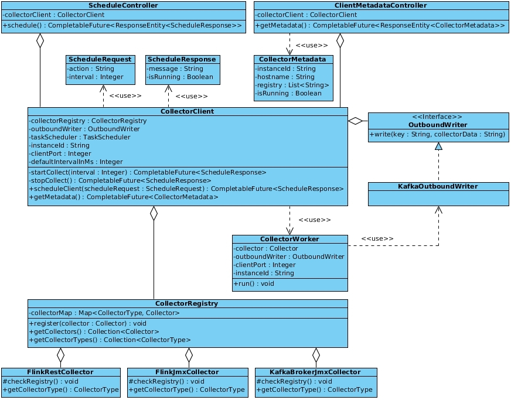

### collector-client

The client component that collects data from source systems they're installed on and produces [Apache Kafka](http://kafka.apache.org) messages containing the result data of the collection process in JSON format.

