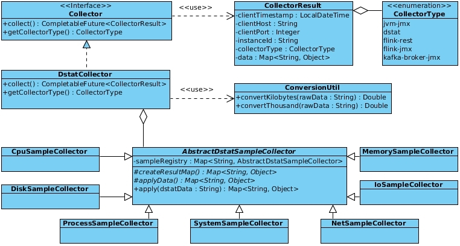
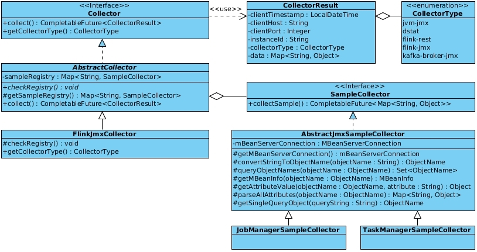
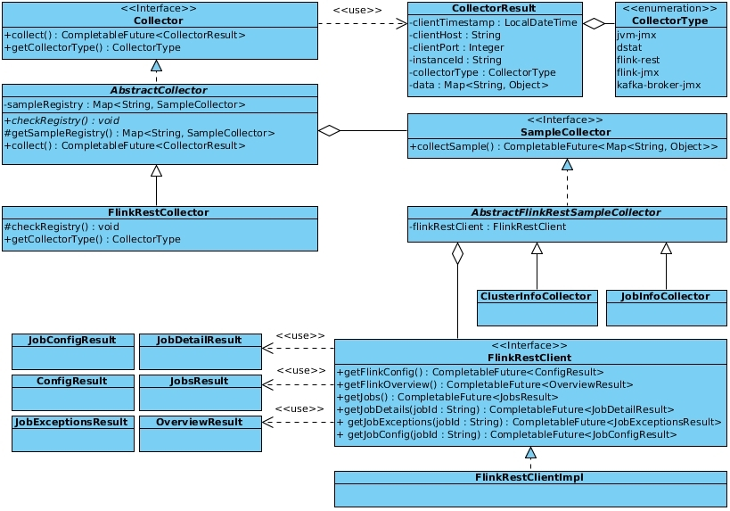
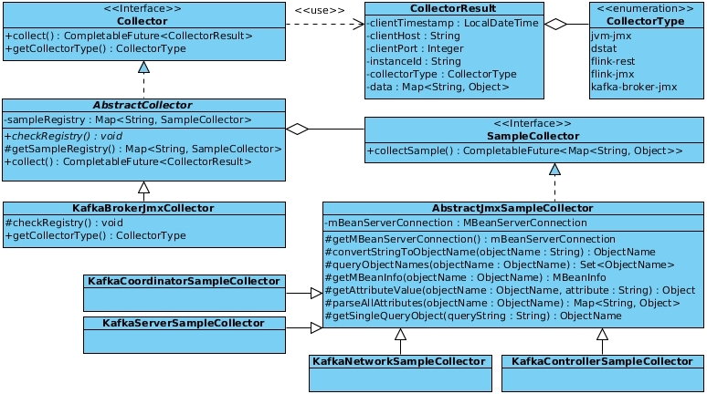

## class-diagrams collectors

###### JvmCollector - io.thesis.collector.jvm.jmx

###### DStatCollector - io.thesis.collector.dstat

###### FlinkJmxCollector - io.thesis.collector.flink.jmx

###### FlinkRestCollector - io.thesis.collector.flink.rest

###### KafkaBrokerJmxCollector - io.thesis.collector.kafka.broker.jmx

